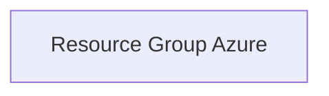

# Projet Terraform Azure: Resource Group

## Description
Ce projet crée un Resource Group Azure simple et configurable via Terraform.

## Architecture Déployée


## Prérequis
- Azure CLI installé et connecté (`az login`)
- Terraform >= 1.3.0
- Un Service Principal Azure avec les permissions nécessaires pour créer des ressources dans la subscription ciblée

## Installation
1. Cloner ce dépôt
2. Copier `terraform.tfvars.example` en `terraform.tfvars` et adapter les valeurs
3. Initialiser Terraform:
```bash
terraform init
```

## Configuration des Variables
- `resource_group_name`: Nom du Resource Group (3-90 caractères)
- `location`: Région Azure (ex: France Central)
- `environment`: Environnement (dev, prod, staging, test)
- `tags`: Tags additionnels
- Variables backend pour configurer le stockage du tfstate

## GitHub Actions
### Secrets à configurer
- `ARM_CLIENT_ID`
- `ARM_CLIENT_SECRET`
- `ARM_SUBSCRIPTION_ID`
- `ARM_TENANT_ID`

### Installation du Workflow
Copiez le fichier `workflow.yml` dans `.github/workflows/` de votre dépôt.

### Explication du Workflow CI/CD
- Déclenchement sur push ou workflow manuel
- Étapes: formatage, validation, plan, scan sécurité (tfsec), apply automatique sur `main`
- Commentaires automatiques sur PR avec résultat du plan
- Cache et artifacts pour optimiser performance

## Commandes Terraform
```bash
terraform init
terraform fmt
terraform validate
terraform plan
terraform apply
terraform destroy
```

## Exemples d'utilisation
- Modifier `terraform.tfvars` puis lancer `terraform apply` pour créer le Resource Group

## Troubleshooting
- Vérifiez que les variables d'environnement et secrets sont bien configurés
- Assurez-vous d'avoir les droits suffisants sur Azure

## Coûts Estimés
La création d'un Resource Group Azure n'engendre pas de coût direct significatif. Les coûts dépendront des ressources déployées dans le Resource Group.