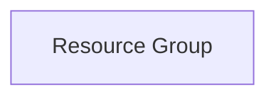

# Projet Terraform Azure Resource Group

## Description

Ce projet Terraform permet de créer un Resource Group dans Microsoft Azure avec des bonnes pratiques d'infrastructure as code et gestion des environnements.

## Architecture déployée



Un simple Resource Group Azure est créé selon les paramètres fournis.

## Prérequis

- [Azure CLI](https://docs.microsoft.com/fr-fr/cli/azure/install-azure-cli) installé et configuré
- [Terraform](https://www.terraform.io/downloads.html) version >= 1.3
- Un Service Principal Azure avec les permissions nécessaires pour créer des ressources (Resource Group Contributor au minimum)
- Permissions sur la Subscription Azure où déployer

## Installation

1. Clonez ce dépôt
2. Copiez le fichier `terraform.tfvars.example` en `terraform.tfvars` et ajustez les valeurs
3. Initialisez Terraform :

```bash
terraform init
```

## Configuration des variables

Les variables principales sont définies dans `variables.tf` et peuvent être configurées via un fichier `terraform.tfvars`.

- `project_name`: Nom du projet
- `resource_group_name`: Nom du Resource Group à créer
- `location`: Région Azure
- `environment`: Environnement (dev, test, prod)
- `tags`: Tags additionnels pour les ressources

## GitHub Actions

### Secrets à configurer

- `ARM_CLIENT_ID`: ID du Service Principal
- `ARM_CLIENT_SECRET`: Secret du Service Principal
- `ARM_SUBSCRIPTION_ID`: ID de la subscription Azure
- `ARM_TENANT_ID`: ID du tenant Azure

### Installation du workflow

Copiez le fichier `workflow.yml` dans le répertoire `.github/workflows/` de votre dépôt GitHub.

### Explication du workflow CI/CD

Le workflow s'exécute sur chaque push et pull request vers la branche `main`. Il réalise :

- Formatage (`terraform fmt`)
- Validation de la configuration (`terraform validate`)
- Analyse de sécurité avec tfsec
- Plan Terraform avec commentaire automatique sur PR
- Apply automatique uniquement après merge sur `main`

Le workflow utilise le cache Terraform et sauvegarde les plans en artifacts.

## Commandes Terraform

- `terraform init` : initialise le backend et les providers
- `terraform fmt` : formate le code Terraform
- `terraform validate` : valide la configuration
- `terraform plan` : affiche le plan de déploiement
- `terraform apply` : applique les changements
- `terraform destroy` : détruit les ressources créées

## Exemples d'utilisation

```bash
terraform init
terraform plan
terraform apply
```

## Troubleshooting

- Assurez-vous que les secrets GitHub sont correctement configurés
- Vérifiez que le Service Principal a les droits nécessaires
- Utilisez `terraform validate` pour détecter les erreurs de configuration

## Coûts estimés Azure

La création d'un Resource Group est gratuite. Les coûts surviennent uniquement lorsque des ressources sont déployées dans ce groupe.
