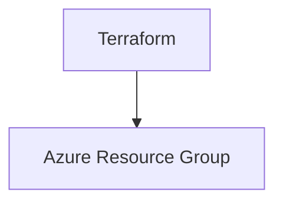

# Terraform Azure Resource Group Module

## Description

Ce projet déploie un Resource Group Azure configurable via Terraform, avec gestion des environnements (dev, staging, prod) et bonnes pratiques de tagging.

## Architecture Déployée



## Prérequis

- Azure CLI installé et configuré
- Terraform version >= 1.3
- Un Service Principal Azure avec les permissions suivantes :
  - `Contributor` ou plus sur la subscription cible
- Variables d'environnement ou secrets GitHub Actions pour :
  - `ARM_CLIENT_ID`
  - `ARM_CLIENT_SECRET`
  - `ARM_SUBSCRIPTION_ID`
  - `ARM_TENANT_ID`

## Installation

1. Clonez ce dépôt
2. Installez Terraform
3. Connectez-vous à Azure via CLI :

```bash
az login
az account set --subscription "<subscription-id>"
```

4. Initialisez Terraform :

```bash
terraform init
```

## Configuration des variables

Copiez `terraform.tfvars.example` en `terraform.tfvars` et ajustez les valeurs selon votre environnement :

```bash
cp terraform.tfvars.example terraform.tfvars
```

## Configuration des Secrets GitHub Actions

Ajoutez les secrets suivants dans votre repository GitHub :

- ARM_CLIENT_ID
- ARM_CLIENT_SECRET
- ARM_SUBSCRIPTION_ID
- ARM_TENANT_ID

## Commandes Terraform

- `terraform init` : Initialise le backend et les providers
- `terraform plan` : Génère un plan d'exécution
- `terraform apply` : Applique les changements
- `terraform destroy` : Détruit l'infrastructure

## Exemples d'utilisation

```bash
terraform apply -var='environment=prod' -var='resource_group_name=rg-prod-example'
```

## Troubleshooting

- Vérifiez que vos secrets Azure sont corrects et valides
- Assurez-vous que votre utilisateur ou SP a les permissions nécessaires
- Utilisez `terraform fmt` et `terraform validate` pour vérifier votre code

## Coûts estimés Azure

Le coût principal est lié au Resource Group, qui est gratuit. Cependant, les ressources créées dans ce groupe peuvent engendrer des coûts.

Pour plus de détails, consultez : https://azure.microsoft.com/en-us/pricing/
