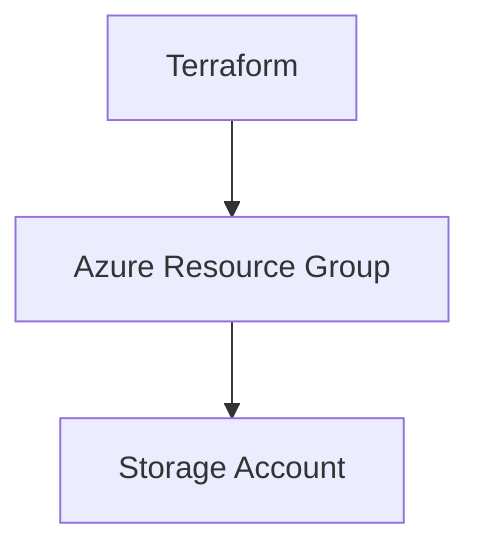

# Terraform Azure Storage Account Deployment

## Description

Ce projet déploie une infrastructure Azure contenant un Storage Account dans un Resource Group dédié, géré via Terraform.

## Architecture



## Prérequis

- Azure CLI installé et connecté (`az login`)
- Terraform version >= 1.3.0 installé
- Permissions Azure :
  - Service Principal avec droits Contributor ou Owner sur la subscription
  - Accès en lecture/écriture au compte de stockage et container pour le backend remote state

## Installation et déploiement

1. Clonez le dépôt
2. Copiez `terraform.tfvars.example` en `terraform.tfvars` et modifiez selon vos besoins
3. Initialisez Terraform :
   ```bash
   terraform init
   ```
4. Validez la configuration :
   ```bash
   terraform validate
   ```
5. Planifiez le déploiement :
   ```bash
   terraform plan
   ```
6. Appliquez le déploiement :
   ```bash
   terraform apply
   ```

## Configuration des variables

- `prefix` : Préfixe pour les noms de ressources
- `environment` : Environnement de déploiement (dev, staging, prod)
- `location` : Région Azure
- `storage_account_tier` : Tier du Storage Account (Standard ou Premium)
- `storage_account_replication_type` : Type de réplication (LRS, GRS, etc.)
- `tags` : Tags appliqués aux ressources
- Backend variables : paramètres pour le stockage du remote state

## Configuration des secrets GitHub Actions

- `ARM_CLIENT_ID`
- `ARM_CLIENT_SECRET`
- `ARM_SUBSCRIPTION_ID`
- `ARM_TENANT_ID`

## Commandes Terraform

- `terraform init` : Initialise le projet
- `terraform plan` : Génère un plan d'exécution
- `terraform apply` : Applique les changements
- `terraform destroy` : Détruit l'infrastructure

## Exemples d'utilisation

Déployer pour un environnement de production :

```hcl
environment = "prod"
location = "westeurope"
```

## Troubleshooting

- Vérifiez que vous êtes connecté à Azure avec `az account show`
- Assurez-vous que les permissions sont suffisantes
- Validez la syntaxe Terraform avec `terraform validate`

## Estimation des coûts

Un Storage Account Standard LRS coûte environ quelques euros par mois selon l'usage. Consultez https://azure.microsoft.com/pricing pour plus de détails.
